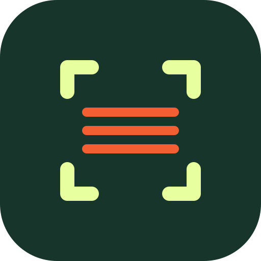
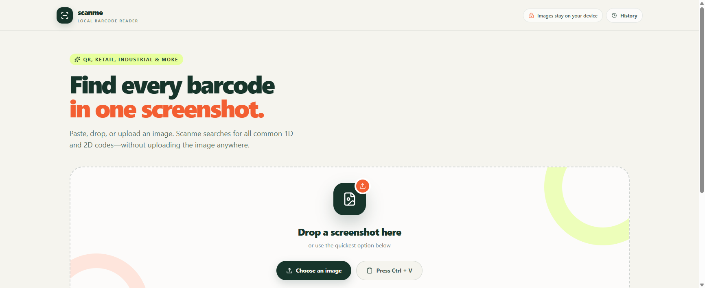
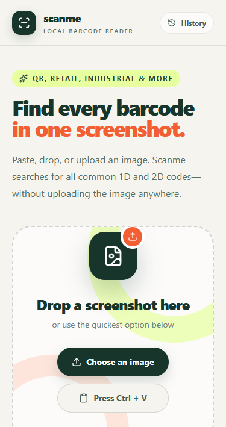

<div align="center">
  
  <h1>Scanme</h1>
  <p><strong>Find every barcode in one screenshot.</strong></p>
  <p>
    Paste, drop, or upload an image and detect multiple 1D and 2D barcodes<br>
    privately in your browser—even offline.
  </p>
  <p>
    <a href="https://scan.bedeh.ro"><strong>Open the live app</strong></a>
    ·
    <a href="https://github.com/Bedeh-A/ScanMe/issues">Report an issue</a>
  </p>
  <p>
    
    
    <a href="LICENSE"></a>
  </p>
</div>

<br>

<div align="center">
  
  &nbsp;
  
</div>

<p align="center"><sub>Designed for desktop workflows and installable on mobile.</sub></p>

## What it does

- Detects multiple barcodes instead of stopping after the first match.
- Supports common QR, retail, logistics, and industrial barcode formats.
- Runs a fast scan first, followed by deeper rotation, inversion, and denoising
  passes.
- Highlights every result over the source image and lets you copy or open values.
- Exports decoded results and their image positions as CSV or JSON.
- Extracts English text locally with optional Tesseract.js OCR.
- Keeps an optional 30-day scan history in IndexedDB without storing screenshots.
- Installs as a PWA and works offline after its required assets are cached.
- Lets users explicitly submit a sanitized missed-barcode image for debugging.
- Provides a private Cloudflare Access-protected report viewer for maintainers.
- Shows the deployed release version and links back to the public source code.

## Privacy model

Barcode scanning, OCR, and scan history are browser-only. The core scanner does
not require a backend.

Missed-barcode reports are the only image upload path. Before submission, Scanme:

1. Re-encodes the image as WebP to remove filenames and embedded metadata.
2. Shows the exact sanitized image that will be uploaded.
3. Requires an unchecked, explicit consent box.
4. Sends no decoded values, OCR output, local history, cookies, or analytics IDs.
5. Stores the report in a private R2 bucket with automatic 30-day expiration.

Cloudflare still processes ordinary network information, such as the sender's IP
address. Report submission is protected by Turnstile, while report viewing is
protected by Cloudflare Access and server-side JWT verification.

## Tech stack

- React 19 and TanStack Router
- TypeScript and Vite
- Tailwind CSS
- `zxing-wasm` for barcode decoding
- Tesseract.js for optional local OCR
- IndexedDB for local history
- Vite PWA and Workbox for installation and offline support
- Cloudflare Workers Static Assets, R2, Turnstile, and Access for optional reports
- Vitest for unit and Worker integration tests

## Getting started

Prerequisites:

- [Bun](https://bun.sh/)
- A modern browser with WebAssembly and Web Worker support

```bash
git clone git@github.com:Bedeh-A/ScanMe.git
cd ScanMe
bun install
bun run dev
```

Open [http://localhost:3001](http://localhost:3001).

The Vite development server supports scanning, OCR, and local history. The optional
report APIs require the Cloudflare Worker setup described below.

## Quality checks

Run the same checks expected before contributing:

```bash
bun run check-types
bun run test
bun run build
```

No credentials, private `.env` files, report images, or local tool caches should be
committed. Treat the repository as public.

## Releases and versioning

Scanme follows [Semantic Versioning](https://semver.org/) and uses
[Release Please](https://github.com/googleapis/release-please) to maintain package
versions, `CHANGELOG.md`, Git tags, and GitHub Releases.

Use Conventional Commit prefixes for changes intended for a release:

```text
fix: prevent duplicate narrow barcode results
feat: add a new scan input source
feat!: change the report API contract
```

- `fix:` produces a patch release.
- `feat:` produces a minor release.
- `!` or a `BREAKING CHANGE:` footer produces a major release.
- Documentation, tests, and maintenance commits do not create a release by
  themselves.

Each push to `main` updates a Release Please pull request. Merging that pull
request:

1. Updates the root and web app versions together.
2. Updates the generated changelog.
3. Creates a `vX.Y.Z` Git tag and matching GitHub Release.
4. Runs all quality checks against that exact tag.
5. Deploys the released build to Cloudflare with `VITE_APP_VERSION=vX.Y.Z`.

Do not manually edit `.release-please-manifest.json`, generated release versions,
or `CHANGELOG.md`. The first planned public release is `v0.1.0`.

## Configuration

Copy `apps/web/.env.example` to `apps/web/.env` and configure only the integrations
you intend to use:

```dotenv
# Optional privacy-limited product analytics
VITE_PUBLIC_POSTHOG_KEY=
VITE_PUBLIC_POSTHOG_HOST=

# Required only for missed-barcode reports
VITE_PUBLIC_TURNSTILE_SITE_KEY=

# Optional release label included in report metadata
VITE_APP_VERSION=development
```

PostHog is optional. When enabled, Scanme records coarse product events without
images, filenames, barcode values, OCR text, or report contents.

## Self-hosting the core scanner

The browser-only scanner can be hosted on any static hosting platform:

```bash
bun install
bun run build
```

Serve the generated `apps/web/dist` directory with SPA fallback to `index.html`.
HTTPS is recommended for clipboard and PWA functionality.

The report button remains unavailable unless its public Turnstile site key and
Worker API are configured.

## Full Cloudflare deployment

The included `apps/web/wrangler.jsonc` deploys the PWA and optional report system
as a Cloudflare Worker with Static Assets.

Full reporting requires:

- A private R2 bucket named `scanme-reports`, bound as `REPORTS`.
- A 30-day R2 lifecycle rule covering the entire bucket.
- A managed Turnstile widget for the deployment hostname.
- A self-hosted Cloudflare Access application covering `/reports`,
  `/reports/*`, `/api/admin/reports`, and `/api/admin/reports/*`.
- An exact-email Allow policy requiring Cloudflare's one-time PIN login method.

Replace the safe `ADMIN_EMAIL`, `POLICY_AUD`, and `TEAM_DOMAIN` placeholders in
`apps/web/wrangler.jsonc` during private deployment provisioning. Do not commit the
real owner email, Turnstile secret, or Cloudflare API token.

Create the R2 resources once:

```bash
cd apps/web
bunx wrangler r2 bucket info scanme-reports ||
  bunx wrangler r2 bucket create scanme-reports
bunx wrangler r2 bucket lifecycle list scanme-reports
bunx wrangler r2 bucket lifecycle add scanme-reports scanme-reports-30-days \
  --expire-days 30
```

Do not add the lifecycle rule again if `scanme-reports-30-days` is already listed.
Store the private Turnstile key through Wrangler's secure prompt:

```bash
cd apps/web
bunx wrangler secret put TURNSTILE_SECRET
```

Then deploy:

```bash
bun run deploy
```

Keep `workers_dev` and preview URLs disabled so alternate hostnames cannot bypass
Cloudflare Access. `robots.txt` and `noindex` provide crawler guidance only; Access
and Worker JWT validation are the security boundary.

### Automated release deployment

The release workflow requires the following GitHub Actions configuration under
**Settings → Secrets and variables → Actions**:

- Secret `CLOUDFLARE_API_TOKEN`.
- Variable `CLOUDFLARE_ACCOUNT_ID`.
- Variable `VITE_PUBLIC_TURNSTILE_SITE_KEY`.
- Optional variables `VITE_PUBLIC_POSTHOG_KEY` and
  `VITE_PUBLIC_POSTHOG_HOST`.

Under **Settings → Actions → General → Workflow permissions**, allow read and
write access and permit GitHub Actions to create pull requests. Release Please
cannot maintain its release pull request without those repository permissions.

Create a dedicated deployment token instead of reusing the Turnstile provisioning
token. Restrict it to the Scanme Cloudflare account and grant:

- Account Settings: Read.
- Workers Scripts: Edit.
- Workers R2 Storage: Edit.
- Zone: Read, limited to `bedeh.ro`.
- Workers Routes: Edit, limited to `bedeh.ro`.

The Turnstile provisioning token should retain only Account Turnstile: Edit. The
deployed `TURNSTILE_SECRET` remains in Cloudflare's Worker secret store and is not
copied into GitHub.

## Project structure

```text
.github/workflows/      Release and production deployment automation
apps/web/
  public/               PWA and crawler assets
  src/components/       Scanner and report UI
  src/lib/barcodes/     Image input, result types, and deduplication
  src/lib/reports/      Report sanitization and shared contracts
  src/routes/           Scanner and private report viewer routes
  src/workers/          Browser barcode-decoding worker
  src/worker.ts         Cloudflare API and static asset worker
packages/
  config/               Shared TypeScript configuration
  env/                  Environment helpers
  ui/                   Shared Tailwind UI primitives
```

## Acknowledgements

Scanme was scaffolded with
[Better-T-Stack](https://www.better-t-stack.dev/), an excellent type-safe starting
point for modern TypeScript applications. Barcode decoding is powered by
[`zxing-wasm`](https://github.com/Sec-ant/zxing-wasm), and OCR by
[`tesseract.js`](https://github.com/naptha/tesseract.js).

## Contributing

Issues and pull requests are welcome. Please include tests for behavior changes and
run the quality checks before submitting.

## License

Copyright (c) 2026 Andrei Bidian.

Licensed under the [MIT License](LICENSE). You may use, modify, distribute, and
self-host Scanme, provided the copyright and license notice are retained in copies
or substantial portions of the software.
